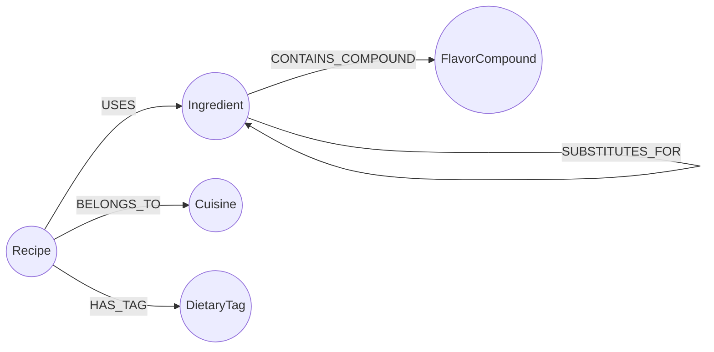
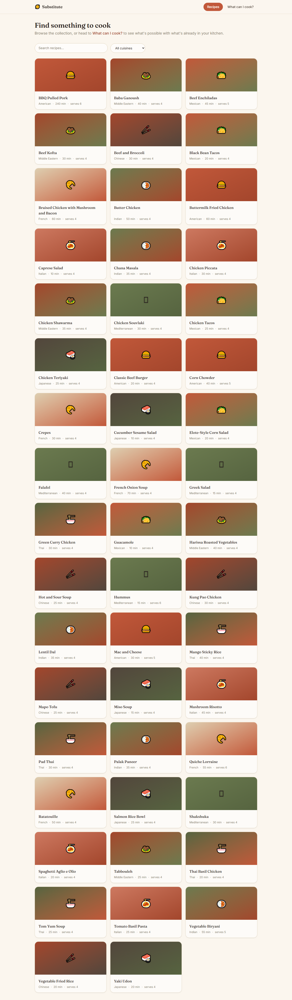
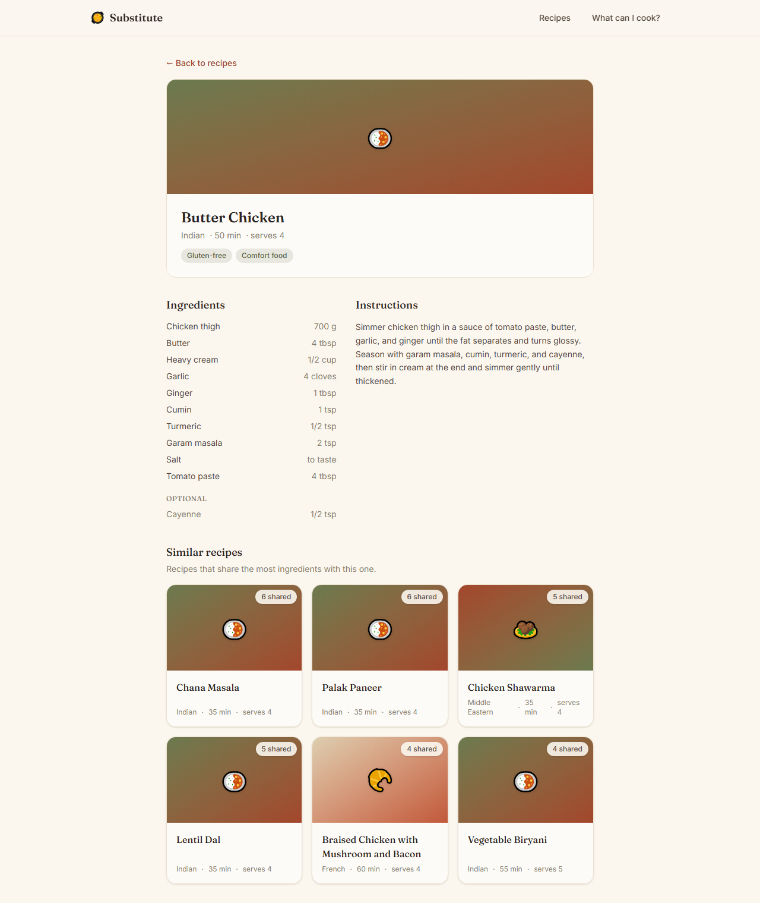
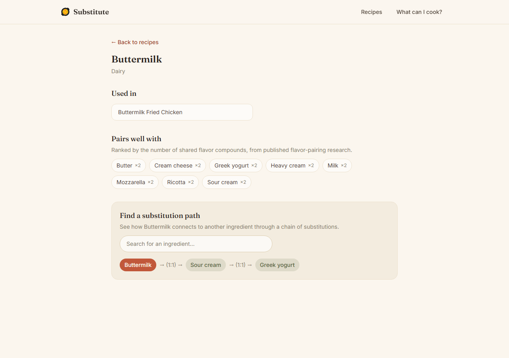
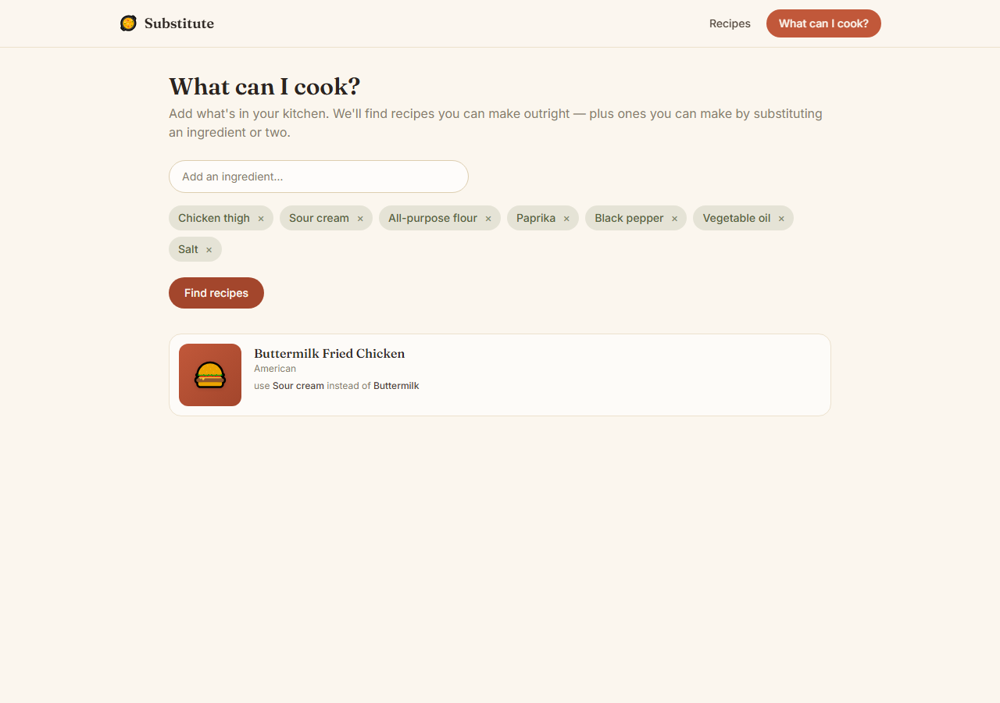

# Substitute 

A kitchen companion backed by a graph database. Add what's in your pantry and
find recipes you can make outright — or almost make, bridged by a chain of
real ingredient substitutions. Explore flavor pairings grounded in shared
aroma compounds, and trace how one ingredient connects to another through
substitutions.

Built for the Wexa AI CognoDB take-home assignment.

- **Live demo:** [substitute-nu.vercel.app](https://substitute-nu.vercel.app/)
- **Screen recording:** [google drive link](https://drive.google.com/file/d/1DqUBEH7b6fFraQ2ihMIy0Ojb2L1g5A6A/view?usp=sharing)

## Contents

- [Why a graph database?](#why-a-graph-database)
- [Data model](#data-model)
- [Architecture](#architecture)
- [Setup](#setup)
- [Running the app](#running-the-app)
- [The main queries](#the-main-queries)
- [Screenshots](#screenshots)
- [Deployment](#deployment)
- [Project structure](#project-structure)

## Why a graph database?

A recipe app's obvious schema is relational: `recipes`, `ingredients`, a
`recipe_ingredients` join table. That works fine for "what's in this
recipe?" It falls apart the moment the interesting question is about
**reachability through a chain of relationships** rather than a single join:

- **"What can I almost cook?"** — a recipe qualifies if every ingredient it
  needs is either in your pantry, or reachable from your pantry through a
  chain of up to two substitutions (buttermilk → yogurt → sour cream). In
  SQL this means a recursive CTE per missing ingredient, re-run per
  candidate recipe, with no natural way to stop the recursion at "close
  enough." In Cypher it's a single variable-length pattern:
  `(needed)-[:SUBSTITUTES_FOR*1..2]-(pantry)`.
- **"How do I get from tamarind to lime?"** — an arbitrary-depth
  shortest-path search over a self-referential many-to-many relationship.
  This is exactly the case relational databases are known to handle badly:
  each extra hop is another self-join, and the depth isn't known in advance.
  Cypher's `shortestPath()` answers it directly, regardless of how many
  hops it takes.
- **"What pairs well with this ingredient?"** — ranking ingredients by how
  many flavor compounds they share is a many-to-many-to-many aggregation.
  In SQL it's a self-join through a bridge table with a `GROUP BY`/`HAVING`;
  in Cypher it's one traversal pattern:
  `(i)-[:CONTAINS_COMPOUND]->(c)<-[:CONTAINS_COMPOUND]-(other)`.

None of this is contrived — a real cooking app genuinely needs "what can I
almost make" and "what pairs with X" to be fast and simple to express. That's
the case for a graph database here: the domain's core questions are about
paths and neighborhoods, not row lookups.

## Data model

**Nodes**

| Label              | Key properties                                                                  |
| ------------------ | ------------------------------------------------------------------------------- |
| `Recipe`         | `id`, `name`, `instructions`, `cuisine`, `prep_minutes`, `servings` |
| `Ingredient`     | `id`, `name`, `category`                                                  |
| `FlavorCompound` | `id`, `name`                                                                |
| `Cuisine`        | `id`, `name`                                                                |
| `DietaryTag`     | `id`, `name`                                                                |

**Relationships**

| Relationship                                            | Properties                           | Meaning                                 |
| ------------------------------------------------------- | ------------------------------------ | --------------------------------------- |
| `(Recipe)-[:USES]->(Ingredient)`                      | `quantity`, `unit`, `optional` | This recipe calls for this ingredient   |
| `(Ingredient)-[:SUBSTITUTES_FOR]->(Ingredient)`       | `ratio`, `note`                  | One ingredient can stand in for another |
| `(Ingredient)-[:CONTAINS_COMPOUND]->(FlavorCompound)` | —                                   | Shared aroma/flavor chemistry           |
| `(Recipe)-[:BELONGS_TO]->(Cuisine)`                   | —                                   | Recipe's cuisine                        |
| `(Recipe)-[:HAS_TAG]->(DietaryTag)`                   | —                                   | e.g. vegetarian, gluten-free, quick     |



The seed dataset (`backend/data/*.json`) is intentionally sized for a clear,
fast demo on CognoDB's free c0 instance (256 MB RAM): 50 real recipes across
10 cuisines, ~145 ingredients, ~40 flavor compounds, ~100 curated
substitution edges, and their relationships — a few thousand nodes and
relationships in total, comfortably inside the "few thousand to a few
hundred thousand" the free tier is meant for.

## Architecture

```
backend/    FastAPI + the official neo4j Python driver
  app/
    config.py     env-var settings (BOLT_URI, BOLT_USER, BOLT_PASSWORD, CORS_ORIGINS)
    db.py         driver lifecycle + graceful error handling (503 on unreachable DB)
    queries.py    every Cypher query used by the app, centralized and parameterized
    models.py     Pydantic response schemas
    routers/      thin route handlers — recipes, ingredients, pantry, health
  scripts/seed.py loads backend/data/*.json into CognoDB (idempotent)
  data/           seed dataset as JSON
frontend/   React + Vite + TypeScript
  src/
    api/client.ts   typed fetch wrapper, one function per endpoint
    pages/          Home, RecipeDetail, IngredientDetail, Pantry
    components/     RecipeCard, IngredientPicker, loading/empty/error states, etc.
```

No string-built Cypher anywhere: every query in `queries.py` takes its
inputs as named `$parameters`, bound through the driver's parameter API.

## Setup

### 1. Create a CognoDB Cloud instance

1. Sign up at [console.cognodb.com/signup](https://console.cognodb.com/signup) (free, no credit card).
2. From the console, create a free **c0** instance and pick a region — it provisions in under a minute.
3. Copy the connection URI (`bolt+s://<instance-id>.databases.cognodb.cloud`) and the generated password for user `cognodb`. **The password is shown once** — save it now.

### 2. Backend

```bash
cd backend
python -m venv .venv
.venv/Scripts/activate      # Windows; use `source .venv/bin/activate` on macOS/Linux
pip install -r requirements.txt
cp .env.example .env        # then fill in BOLT_URI / BOLT_USER / BOLT_PASSWORD
python -m scripts.seed      # loads the seed dataset into CognoDB
uvicorn app.main:app --reload --port 8000
```

### 3. Frontend

```bash
cd frontend
npm install
cp .env.example .env        # VITE_API_BASE_URL, defaults to http://localhost:8000
npm run dev
```

Open the printed local URL (default `http://localhost:5173`).

## Running the app

- **Browse & search** recipes by name or cuisine on the home page.
- **Open a recipe** to see its ingredients (with quantities), instructions,
  dietary tags, and similar recipes (ranked by shared ingredients).
- **Click an ingredient** to see what it's used in, what it pairs well with
  (shared flavor compounds), and to find a substitution path to any other
  ingredient.
- **"What can I cook?"** — add pantry ingredients and see every recipe you
  can make, with a note on which ingredients are substituted and for what.

If CognoDB is unreachable, every page shows a clear error state with a retry
button instead of crashing — try it by stopping the backend or pointing
`BOLT_URI` at a bad host.

## The main queries

All queries live in [`backend/app/queries.py`](backend/app/queries.py).

**1. "What can I almost cook?"** — the flagship query. Every non-optional
ingredient a recipe needs must be in the pantry directly, or reachable via a
substitution chain of at most 2 hops:

```cypher
MATCH (needed:Ingredient)<-[:USES]-(r:Recipe)
WHERE NOT needed.id IN $pantry_ids
OPTIONAL MATCH bridge = shortestPath((needed)-[:SUBSTITUTES_FOR*1..2]-(pantry:Ingredient))
WHERE pantry.id IN $pantry_ids
WITH r, needed, bridge
WHERE bridge IS NOT NULL
RETURN r.id AS recipe_id, needed.id AS ingredient_id, ...
```

The set-covering logic (does *every* required ingredient clear this bar?)
runs in `app/routers/pantry.py` in plain Python, on top of this one flat
query plus the full recipe/ingredient need-list — deliberately split this
way so the whole thing stays easy to read end to end.

**2. Substitution shortest path** — a 2+ hop, unbounded-depth traversal:

```cypher
MATCH (a:Ingredient {id: $from_id}), (b:Ingredient {id: $to_id})
OPTIONAL MATCH path = shortestPath((a)-[:SUBSTITUTES_FOR*..6]-(b))
RETURN [n IN nodes(path) | {id: n.id, name: n.name}] AS path_nodes, ...
```

**3. Flavor pairing** — ingredients ranked by shared `FlavorCompound` nodes:

```cypher
MATCH (i:Ingredient {id: $ingredient_id})-[:CONTAINS_COMPOUND]->(c:FlavorCompound)
      <-[:CONTAINS_COMPOUND]-(other:Ingredient)
WHERE other.id <> $ingredient_id
WITH other, count(DISTINCT c) AS shared_compounds
ORDER BY shared_compounds DESC
```

**4. Similar recipes** — a 2-hop `Recipe → Ingredient ← Recipe` traversal,
ranked by shared ingredient count (graph-native "recipes like this one").

**5. Recipe detail** — pulls a recipe's ingredients (with per-relationship
quantity/unit/optional properties) and dietary tags in one round trip.

## Screenshots

**Browse & search** — 50 recipes across 10 cuisines, filterable by name and cuisine.



**Recipe detail** — ingredients, instructions, and graph-ranked similar recipes (shared-ingredient count).



**Substitution path finder** — a live multi-hop traversal: Buttermilk → Sour cream → Greek yogurt.



**"What can I cook?"** — the flagship pantry query, showing exactly which substitutions bridge the gap.



## Deployment

Both frontend and backend deploy together as one [Vercel](https://vercel.com)
project using [Vercel Services](https://vercel.com/docs/services) — the root
`vercel.json` defines a `frontend` (Vite) and `backend` (FastAPI) service under
one domain, with `/api/*` routed to the backend and everything else to the
frontend. Because they share an origin, the browser never makes a cross-origin
request, so no CORS configuration is needed in production.

Required environment variables, set in the Vercel project dashboard (never
committed):

- **backend service**: `BOLT_URI`, `BOLT_USER`, `BOLT_PASSWORD` (from your
  CognoDB instance).
- **frontend service**: `VITE_API_BASE_URL` set to an empty string, so API
  calls resolve to relative `/api/...` paths through the same-origin rewrite.

A standalone `backend/render.yaml` is also kept in the repo as a fallback if
you'd rather split the backend onto [Render](https://render.com) and the
frontend onto Vercel/Netlify separately — in that case set `CORS_ORIGINS` on
the backend to the frontend's deployed origin, and `VITE_API_BASE_URL` on the
frontend to the backend's full URL.

After deploying, remember to keep the CognoDB instance running so the hosted
demo stays live.

## Project structure

```
backend/
  app/            FastAPI application (config, db, queries, models, routers)
  scripts/seed.py seed-loading script
  data/           seed dataset (JSON)
  requirements.txt
  .env.example
frontend/
  src/            React app (pages, components, api client)
  .env.example
```
